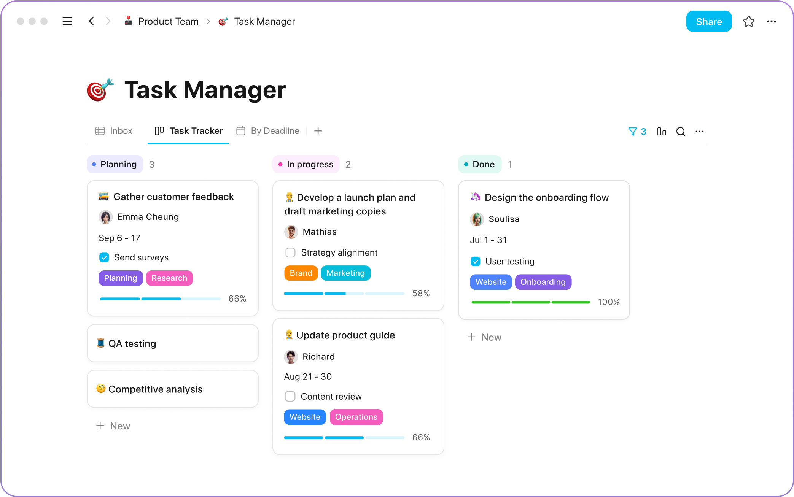

<!--
NOTA: Este README foi creado automáticamente por <https://github.com/YunoHost/apps/tree/master/tools/readme_generator>
NON debe editarse manualmente.
-->

# AppFlowy para YunoHost

[](https://ci-apps.yunohost.org/ci/apps/appflowy/)


[](https://install-app.yunohost.org/?app=appflowy)

*[Le este README en outros idiomas.](./ALL_README.md)*

> *Este paquete permíteche instalar AppFlowy de xeito rápido e doado nun servidor YunoHost.*  
> *Se non usas YunoHost, le a [documentación](https://yunohost.org/install) para saber como instalalo.*

## Vista xeral

AppFlowy is the AI workspace where you achieve more without losing control of your data


**Versión proporcionada:** 0.9.18~ynh2

## Capturas de pantalla



## Documentación e recursos

- Web oficial da app: <https://appflowy.io/>
- Documentación oficial para usuarias: <https://docs.appflowy.io/docs/guides/appflowy/self-hosting-appflowy>
- Documentación oficial para admin: <https://github.com/AppFlowy-IO/AppFlowy-Cloud/blob/main/doc/DEPLOYMENT.md>
- Repositorio de orixe do código: <https://github.com/AppFlowy-IO/AppFlowy-Cloud>
- Tenda YunoHost: <https://apps.yunohost.org/app/appflowy>
- Informar dun problema: <https://github.com/YunoHost-Apps/appflowy_ynh/issues>

## Info de desenvolvemento

Envía a túa colaboración á [rama `testing`](https://github.com/YunoHost-Apps/appflowy_ynh/tree/testing).

Para probar a rama `testing`, procede deste xeito:

```bash
sudo yunohost app install https://github.com/YunoHost-Apps/appflowy_ynh/tree/testing --debug
ou
sudo yunohost app upgrade appflowy -u https://github.com/YunoHost-Apps/appflowy_ynh/tree/testing --debug
```

**Máis info sobre o empaquetado da app:** <https://yunohost.org/packaging_apps>
